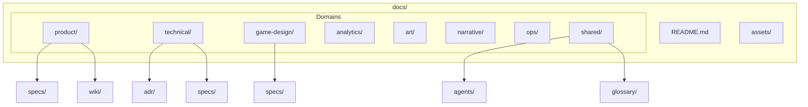

# RepoMind documentation structure

Two orthogonal axes organize every page under `docs/`:

| Axis | Field / path | Question it answers |
|------|----------------|---------------------|
| **Domain** | `domain:` + first path segment | *Which area of the project?* |
| **Type** | `type:` + type subfolder | *What kind of document?* |



## Domain catalog

| Domain id | Label | Scope | Typical content |
|-----------|-------|-------|-----------------|
| `product` | Product | User value, roadmap, prioritization | PRD, user stories, product specs, product open questions |
| `technical` | Technical | Engineering, architecture, delivery | ADR, API specs, infra, technical glossary |
| `game-design` | Game design | Mechanics, balance, player loops | System specs, tuning docs, design glossary |
| `analytics` | Analytics | Measurement, experiments | Event dictionaries, metric definitions, dashboard specs |
| `art` | Art | Visual identity, assets | Style guides, asset specs, UI art wiki |
| `narrative` | Narrative | Story and text | Lore bible, quest outlines, character wiki |
| `ops` | Operations | Live service, releases | Runbooks, release checklists, incident playbooks |
| `shared` | Shared | Cross-domain | Global glossary, agent instructions, project-wide wiki |

## Type subfolders per domain

Created by `repo-mind init`:

| Domain | Subfolders |
|--------|------------|
| `product` | `specs/`, `wiki/`, `open-questions/` |
| `technical` | `adr/`, `specs/`, `glossary/`, `wiki/` |
| `game-design` | `specs/`, `glossary/`, `wiki/` |
| `analytics` | `specs/`, `wiki/` |
| `art` | `wiki/`, `specs/` |
| `narrative` | `wiki/`, `specs/` |
| `ops` | `specs/`, `wiki/` |
| `shared` | `agents/`, `glossary/`, `wiki/` |

You may add subfolders (e.g. `technical/specs/api/`) — type is inferred from the nearest matching segment (`specs` → `feature-spec`).

## Canonical path pattern

```
docs/{domain}/{type-folder}/{slug}.md
```

Examples:

```
docs/product/specs/onboarding-flow.md
docs/technical/adr/use-postgres.md
docs/game-design/specs/combat-system.md
docs/analytics/specs/event-dictionary.md
docs/shared/glossary/mcp.md
docs/shared/agents/query-first.md
docs/narrative/wiki/world-lore.md
```

Each `{domain}/README.md` is the domain index. Each `{domain}/{type-folder}/README.md` optional when the section grows.

## Domain × type matrix (what goes where)

| | `feature-spec` | `adr` | `glossary-term` | `open-question` | `wiki-page` | `agent-instruction` |
|---|:---:|:---:|:---:|:---:|:---:|:---:|
| **product** | PRD, feature brief | rare | product terms | prioritization | product wiki | — |
| **technical** | API, modules | **primary** | tech terms | arch tradeoffs | tech notes | — |
| **game-design** | systems, balance | design decisions | mechanic terms | tuning open Q | design wiki | — |
| **analytics** | events, metrics | — | metric defs | experiment Q | analytics wiki | — |
| **art** | asset specs | style decisions | art terms | — | moodboards wiki | — |
| **narrative** | quest specs | story decisions | lore terms | plot open Q | lore wiki | — |
| **ops** | runbook specs | ops decisions | ops terms | process Q | ops wiki | — |
| **shared** | — | — | **global glossary** | — | general wiki | **agent rules** |

Empty cells mean “unusual — prefer another domain or `wiki-page`”.

## Legacy flat layout (supported)

Pre-domain repos may still use:

```
docs/adr/foo.md
docs/specs/bar.md
```

These infer `domain: shared`. Migrate gradually:

1. Move files under `docs/{domain}/{type-folder}/`
2. Add `domain:` to frontmatter
3. Run `repo-mind check`

## Structured files and assets

```
docs/assets/                    # images referenced from markdown
docs/analytics/specs/events.yaml  # yaml/json — no frontmatter, domain from path
```

## Agent routing rules

When creating a page, decide in order:

1. **Domain** — who owns this knowledge? (product vs technical vs game-design …)
2. **Type** — ADR vs spec vs glossary vs wiki?
3. **Path** — `docs/{domain}/{type-folder}/{kebab-name}.md`
4. **Frontmatter** — `type`, `domain`, `slug`, `status`, `title`, `related`, `updated`
5. **Links** — wikilinks in body; 2–5 strategic slugs in `related:`

Cross-domain links are normal: a game-design spec may `related: [combat-events]` pointing to an analytics spec.
